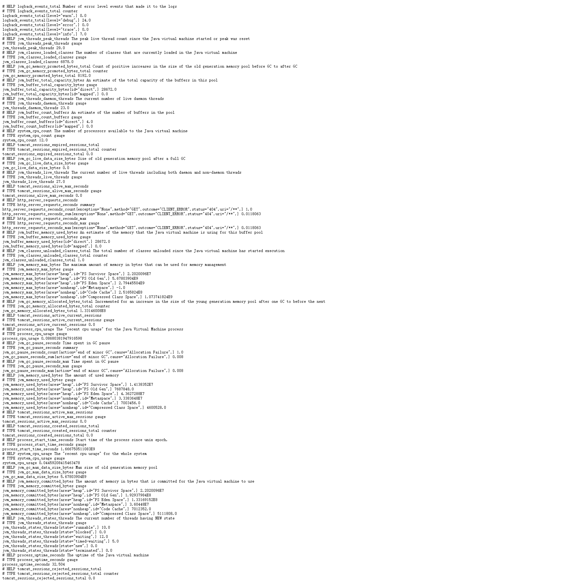

首先创建一个 Maven 项目，然后在 pom.xml 文件中引入以下依赖。

```xml
<dependencies>
    <dependency>
        <groupId>org.springframework.boot</groupId>
        <artifactId>spring-boot-starter-web</artifactId>
    </dependency>
    <dependency>
        <groupId>org.springframework.boot</groupId>
        <artifactId>spring-boot-starter-actuator</artifactId>
    </dependency>
    <dependency>
        <groupId>io.micrometer</groupId>
        <artifactId>micrometer-registry-prometheus</artifactId>
    </dependency>
    <dependency>
        <groupId>org.projectlombok</groupId>
        <artifactId>lombok</artifactId>
    </dependency>
</dependencies>
<dependencyManagement>
    <dependencies>
        <dependency>
            <groupId>org.springframework.boot</groupId>
            <artifactId>spring-boot-dependencies</artifactId>
            <version>2.3.2.RELEASE</version>
            <type>pom</type>
            <scope>import</scope>
        </dependency>
    </dependencies>
</dependencyManagement>
```

在 `application.yml` 文件中开放 prometheus 监控端点。

```yaml
debug: true
server:
  port: 8080
management:
  endpoints:
    web:
      exposure:
        include: health, info, prometheus
spring:
  application:
    name: spring-boot-micrometer
```

启动 SpringBoot 项目，访问 http://127.0.0.1:8080/actuator/prometheus 地址，查看 prometheus 指标信息。



集成完成。