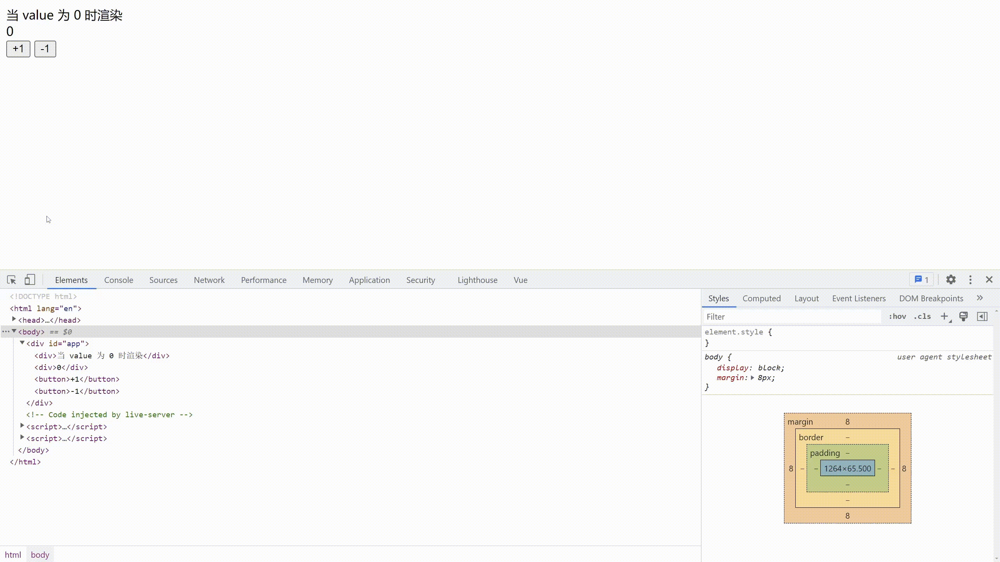

# v-if 指令与 v-show 指令

`v-if` 指令和 `v-show` 指令都是用来控制元素是否显示的，区别在于它们控制显示的原理。v-if 指令是通过控制元素的上下树来控制元素是否显示，而 v-show 是通过控制元素的 display 属性来控制元素是否显示。下面是代码的演示。

```html
<!DOCTYPE html>
<html lang="en">

<head>
    <meta charset="UTF-8">
    <meta http-equiv="X-UA-Compatible" content="IE=edge">
    <meta name="viewport" content="width=device-width, initial-scale=1.0">
    <title>Vue</title>
    <script src="./js/vue.js"></script>
</head>

<body>
    <div id="app">
        <div v-if="true">我是 v-if 指令</div>
        <div v-show="true">我是 v-show 指令</div>
    </div>
</body>

</html>
<script>
    var app = new Vue({
        el: '#app',
    });
</script>
```

下面是代码的演示效果：


然后我们把 v-if 的值改为 `false` ，看看效果如何。


可以看到，`我是 v-if 指令` 这个元素并不在 DOM 树上，所以在界面上看不到这个元素。

然后我们把 v-show 的值改为 `false`，看看效果如何。

 

可以看到，`我是 v-show 指令` 这个元素已经加载到 DOM 树上了。但这个元素上被添加了一个值为 `display: none` 的内联样式，所以在界面上没有渲染出来。

除此之外，v-if 指令还可以搭配 `v-else-if` 指令和 `v-else` 指令使用，做到条件渲染的功能。例如像这样：

```html
<!DOCTYPE html>
<html lang="en">

<head>
    <meta charset="UTF-8">
    <meta http-equiv="X-UA-Compatible" content="IE=edge">
    <meta name="viewport" content="width=device-width, initial-scale=1.0">
    <title>Vue</title>
    <script src="./js/vue.js"></script>
</head>

<body>
    <div id="app">
        <div v-if="value == 0">当 value 为 0 时渲染</div>
        <div v-else-if="value == 1">当 value 为 1 时渲染</div>
        <div v-else>当 value 为其他值时渲染</div>
        <div>{{ value }}</div>
        <button @click="value++">+1</button>
        <button @click="value--">-1</button>
    </div>
</body>

</html>
<script>
    var app = new Vue({
        el: '#app',
        data: {
            value: 0
        }
    });
</script>
```

 操作过程如下：




这对搞 java 的人来说就很好理解了，差不多就是下面这个意思：

```java
if (value == 0){
    System.out.println("当 value 为 0 时渲染");
} else if (value == 1){
    System.out.println("当 value 为 1 时渲染");
} else {
    System.out.println("当 value 为其他值时渲染");
}
```

但在 `v-if`、`v-else-if` 和 `v-else` 搭配使用时，指令是必须紧密挨着的，否则达不到分支的效果。例如这样：

```html
<!DOCTYPE html>
<html lang="en">

<head>
    <meta charset="UTF-8">
    <meta http-equiv="X-UA-Compatible" content="IE=edge">
    <meta name="viewport" content="width=device-width, initial-scale=1.0">
    <title>Vue</title>
    <script src="./js/vue.js"></script>
</head>

<body>
    <div id="app">
        <div v-if="value == 0">当 value 为 0 时渲染</div>
        <div v-else-if="value == 1">当 value 为 1 时渲染</div>
        <div>我是隔断元素</div>
        <div v-else>当 value 为其他值时渲染</div>
        <div>{{value}}</div>
        <button @click="value++">+1</button>
        <button @click="value--">-1</button>
    </div>
</body>

</html>
<script>
    var app = new Vue({
        el: '#app',
        data: {
            value: 0
        }
    });
</script>
```

我在 `v-else-if` 和 `v-else` 之间加了一个 div 对分支进行阻断。效果是这样的：


可以看到，`v-else` 的判断没有生效。

以上为我对 v-if 与 v-show 指令的理解。